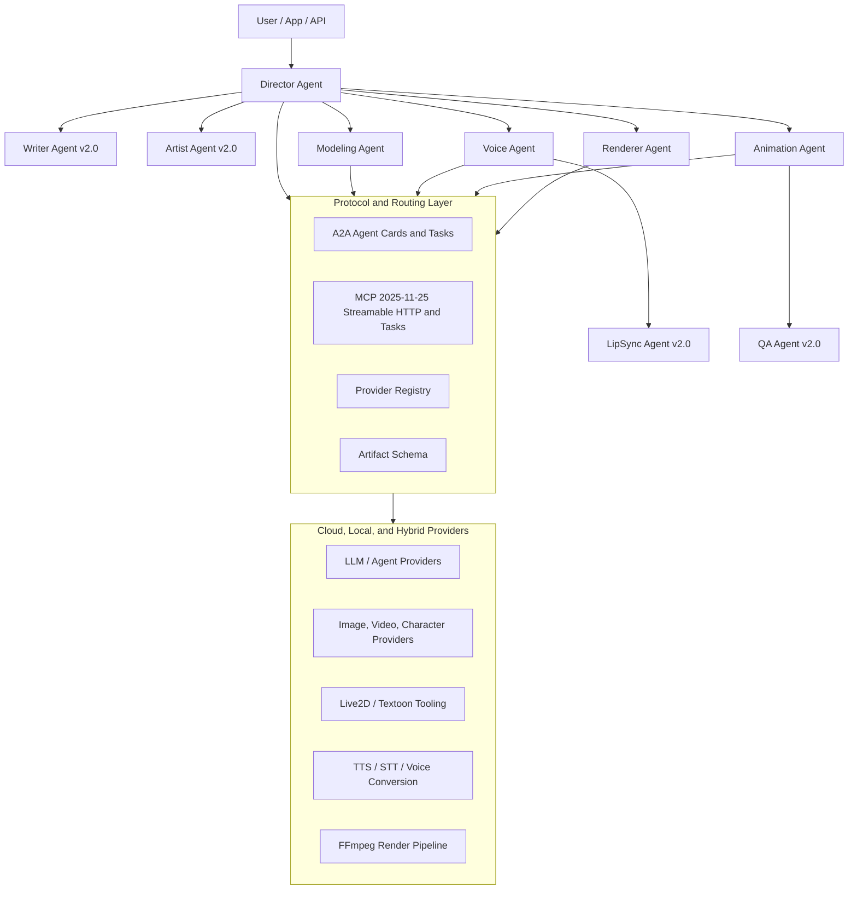

# L2MAS: Live2D Multi-Agent Animation System

[](https://python.org)
[](https://modelcontextprotocol.io)
[](https://a2a-protocol.org)
[](https://docker.com)
[](LICENSE)
[](docs/releases/v0.1.0.md)

Protocol-first Live2D multi-agent animation prototype for the 2026 agent ecosystem.

L2MAS explores how creative agents can plan, generate, voice, animate, review, and render Live2D animation through interoperable protocols. It uses A2A for agent collaboration, MCP 2025-11-25 + Streamable HTTP + Tasks for tool access, and a provider registry so cloud models and local models are first-class peers.

Qwen3.7-Max, Gemini Omni, Eleven v3, Textoon, and Live2D Cubism 5.3 are treated as 2026 capability baselines, not hard-coded dependencies.

## At a Glance

| Signal | What to know |
| --- | --- |
| Purpose | Prototype a protocol-first, multi-agent Live2D animation pipeline. |
| Search keywords | Live2D, multi-agent AI, AI agents, MCP, Model Context Protocol, A2A, Agent2Agent, local AI, ComfyUI, Ollama, vLLM, FFmpeg, VTuber. |
| Runs today | Deterministic mock MVP plus a local FFmpeg `video.compose` smoke path. |
| Extension model | Provider registry and capability routing; agents call capabilities, not fixed model names. |
| Best for | AI agent builders, Live2D/VTube tooling researchers, local AI workflow developers, and animation automation experiments. |

## Languages

English is the canonical documentation entry. Localized READMEs are limited to the top language set for Live2D technical development and community distribution: English, Simplified Chinese, Korean, Spanish, and Japanese.

| Language | README |
| --- | --- |
| English | [README.md](README.md) |
| 简体中文 | [README.zh-CN.md](README.zh-CN.md) |
| 한국어 | [README.ko.md](README.ko.md) |
| Español | [README.es.md](README.es.md) |
| 日本語 | [README.ja.md](README.ja.md) |

Translation policy: [docs/i18n/README.md](docs/i18n/README.md).

## Project Status

L2MAS is an early open-source prototype. The repository is designed around a two-stage roadmap:

| Stage | Goal | Status |
| --- | --- | --- |
| MVP prototype | Run a local end-to-end path: `script -> storyboard -> model -> voice -> motion -> render` | In progress |
| v2.0 architecture | Evolve into distributed A2A agents, MCP tool clusters, streaming task progress, Kubernetes, observability, security, and multi-tenant provider routing | Planned |

Current agent skeletons:

| Agent | MVP role | v2.0 direction |
| --- | --- | --- |
| Director | Storyboard planning and orchestration | Cross-agent task routing and quality gates |
| Modeling | Sample model, Textoon local pipeline, or mock Live2D model path | Text/image-to-Live2D provider routing |
| Voice | Cloud/local TTS or mock audio artifact | Emotional TTS, voice conversion, STT integration |
| Animation | Motion and expression parameter planning | Motion generation, lip-sync aware shot animation |
| Renderer | FFmpeg local composition | Distributed MCP render service |

Planned v2.0 agents include Writer, Artist, LipSync, and QA.

## Why This Exists

Most AI animation experiments bind directly to one model, one tool API, or one workflow graph. L2MAS instead separates the system into:

- **Generic protocol layer**: A2A, MCP, task state, artifact schema, provider registry, and capability routing.
- **Specialized creative layer**: Live2D, Textoon, VTube/Live2D runtime, FFmpeg, TTS/STT, video generation, and video editing providers.
- **Cloud/local parity**: local providers are not a fallback afterthought; they are a supported deployment mode for privacy, cost control, offline work, and experimentation.

Agents call capabilities such as `voice.generate` or `motion.generate`. They do not call a fixed vendor model directly.

## Architecture



## Capability Surface

The project standardizes on capability names that can be routed to cloud, local, or hybrid providers:

| Capability | Purpose |
| --- | --- |
| `script.plan` | script planning, storyboard structure, shot metadata |
| `character.generate` | character concepts, visual references, style exploration |
| `model.live2d.generate` | Live2D model generation or model artifact selection |
| `voice.generate` | dialogue voice generation |
| `speech.transcribe` | speech-to-text or phoneme preparation |
| `voice.convert` | voice conversion or cloning workflows |
| `lip_sync.align` | phoneme, viseme, and mouth-shape alignment |
| `motion.generate` | expression, pose, parameter, and motion sequencing |
| `video.compose` | scene composition and final render |
| `video.edit` | post-generation video editing |
| `quality.review` | script, motion, audio, render, and policy review |

## Provider Registry

Provider registry is the central contract for model and tool routing. Example: [config/provider_registry.example.json](config/provider_registry.example.json).

Required fields:

| Field | Meaning |
| --- | --- |
| `provider_id` | stable provider identifier |
| `locality` | `cloud`, `local`, or `hybrid` |
| `protocol` | `openai-compatible`, `ollama`, `mcp`, `comfyui`, `a2a`, or `custom-rest` |
| `capabilities` | supported capability names |
| `endpoint` | cloud API, local service URL, or MCP/A2A endpoint |
| `models` | available model identifiers or workflow names |
| `hardware_profile` | expected hardware or runtime profile |
| `priority` | routing priority; lower is preferred |
| `fallbacks` | ordered fallback provider IDs |
| `privacy_mode` | `remote`, `local-only`, or `hybrid` |
| `status` | `verified`, `experimental`, `template`, or `mock` |
| `live_test_env` | optional environment variable that enables live provider tests |
| `auth_env` | optional API key environment variable |
| `healthcheck` | optional HTTP or binary probe metadata |

Provider availability is intentionally conservative. As of the current development state, `local-ffmpeg` is the only live-verified non-mock provider. Other real adapters are contract-tested as `experimental` or held as `template` entries until a live service is validated.

## Local Model Support

L2MAS treats local inference and local media pipelines as first-class runtime targets.

| Category | Cloud baseline examples | Local/self-hosted compatibility |
| --- | --- | --- |
| LLM / Agent | Qwen3.7-Max, Claude, GPT, Gemini | OpenAI-compatible endpoint, Ollama, vLLM, LM Studio, llama.cpp server |
| Image / video / character | Gemini Omni, specialized image/video APIs | ComfyUI local API, Diffusers worker, Textoon local pipeline |
| TTS / STT | Eleven v3, cloud STT/TTS APIs | local TTS, Whisper, whisper.cpp |
| Voice conversion | cloud voice conversion APIs | RVC-like and SeedVC-like providers |
| Embedding / rerank | cloud embedding/rerank APIs | local embedding services, OpenAI-compatible embedding endpoints |
| Render / compose | hosted media processing | FFmpeg local, FFmpeg MCP server |

## Quick Start

Validate the current prototype configuration:

```bash
cp .env.example .env
docker compose config
```

Validate JSON configuration:

```bash
python3 -m json.tool config/a2a_config.json > /dev/null
python3 -m json.tool config/mcp_config.json > /dev/null
python3 -m json.tool config/provider_registry.example.json > /dev/null
```

Run the deterministic local MVP smoke tests:

```bash
python3 -m unittest discover -s tests -v
```

Generate a provider verification probe report without enabling live network probes:

```bash
python3 examples/probe_providers.py --output output/provider-probe.json
```

If FFmpeg is available, the non-mock path can produce a real local MP4 container for `video.compose` while earlier generation stages remain deterministic prototype artifacts.

Use a local LLM by starting any compatible endpoint, then prioritizing that provider in the registry:

- Ollama: `http://localhost:11434`
- vLLM OpenAI-compatible server
- LM Studio local server
- llama.cpp server
- Any OpenAI-compatible endpoint

The MVP path must remain runnable with mock or local providers when cloud API keys are absent.

## Documentation

| Document | Purpose |
| --- | --- |
| [docs/architecture/two-stage-roadmap.md](docs/architecture/two-stage-roadmap.md) | MVP to v2.0 architecture roadmap |
| [deployment_guide.md](deployment_guide.md) | English deployment and evolution guide |
| [deployment_guide.zh-CN.md](deployment_guide.zh-CN.md) | Simplified Chinese deployment guide |
| [config/provider_registry.example.json](config/provider_registry.example.json) | provider registry reference example |
| [docs/provider-verification.md](docs/provider-verification.md) | provider status, live verification, and disclosure policy |
| [docs/i18n/README.md](docs/i18n/README.md) | localization policy |
| [docs/github/repository-launch-checklist.md](docs/github/repository-launch-checklist.md) | GitHub publishing checklist and metadata |
| [docs/github/discovery-profile.md](docs/github/discovery-profile.md) | GitHub discovery profile, topics, labels, and community funnel |
| [docs/releases/v0.1.0.md](docs/releases/v0.1.0.md) | v0.1.0 release notes |
| [docs/releases/v0.2.0-draft.md](docs/releases/v0.2.0-draft.md) | v0.2.0 draft notes and verification policy |

## Open Source

L2MAS is licensed under Apache-2.0.

| Community file | Purpose |
| --- | --- |
| [CONTRIBUTING.md](CONTRIBUTING.md) | contribution workflow and validation |
| [CODE_OF_CONDUCT.md](CODE_OF_CONDUCT.md) | community behavior expectations |
| [SECURITY.md](SECURITY.md) | private vulnerability reporting |
| [SUPPORT.md](SUPPORT.md) | support channels and issue guidance |
| [CHANGELOG.md](CHANGELOG.md) | notable changes |
| [GOVERNANCE.md](GOVERNANCE.md) | maintainer-led governance |
| [CITATION.cff](CITATION.cff) | citation metadata for GitHub |

Do not commit API keys, private endpoints, proprietary model weights, commercial media, or unauthorized Live2D assets.

This project is not affiliated with Live2D Inc. Live2D, Cubism, and related names are trademarks or registered trademarks of their respective owners.

## GitHub Discovery

Suggested repository description:

> Live2D multi-agent animation prototype with MCP, A2A, provider routing, local AI, ComfyUI/Ollama/vLLM, and FFmpeg.

Suggested topics:

`live2d`, `vtuber`, `animation-generation`, `text-to-animation`, `generative-ai`, `ai-agents`, `multi-agent`, `mcp`, `model-context-protocol`, `a2a`, `agent-to-agent`, `provider-registry`, `local-ai`, `openai-compatible`, `ollama`, `vllm`, `comfyui`, `diffusers`, `ffmpeg`, `python`

More launch details: [docs/github/discovery-profile.md](docs/github/discovery-profile.md).

## Keywords

Live2D animation generation, multi-agent AI, AI agents, MCP, Model Context Protocol, A2A, Agent2Agent, provider registry, capability routing, local AI, Ollama, vLLM, LM Studio, llama.cpp, ComfyUI, Diffusers, FFmpeg, Textoon, TTS, STT, lip sync, VTuber automation, cloud local hybrid AI.

## References

- [Model Context Protocol Specification](https://modelcontextprotocol.io/specification/2025-11-25)
- [Agent2Agent Protocol Specification](https://a2a-protocol.org/latest/specification/)
- [GitHub repository topics](https://docs.github.com/en/github/administering-a-repository/classifying-your-repository-with-topics)
- [GitHub community profiles](https://docs.github.com/en/communities/setting-up-your-project-for-healthy-contributions/about-community-profiles-for-public-repositories)
- [GitHub citation files](https://docs.github.com/repositories/managing-your-repositorys-settings-and-features/customizing-your-repository/about-citation-files)
- [Live2D Cubism](https://www.live2d.com/en/cubism/update/)
- [Textoon](https://github.com/Human3DAIGC/Textoon)
- [ElevenLabs Models](https://elevenlabs.io/docs/overview/models)
